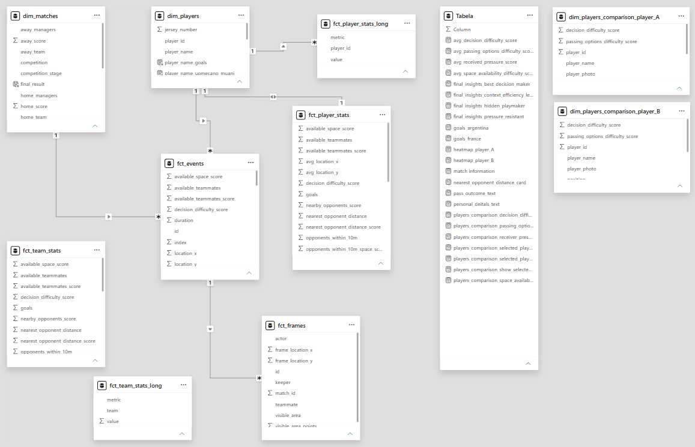
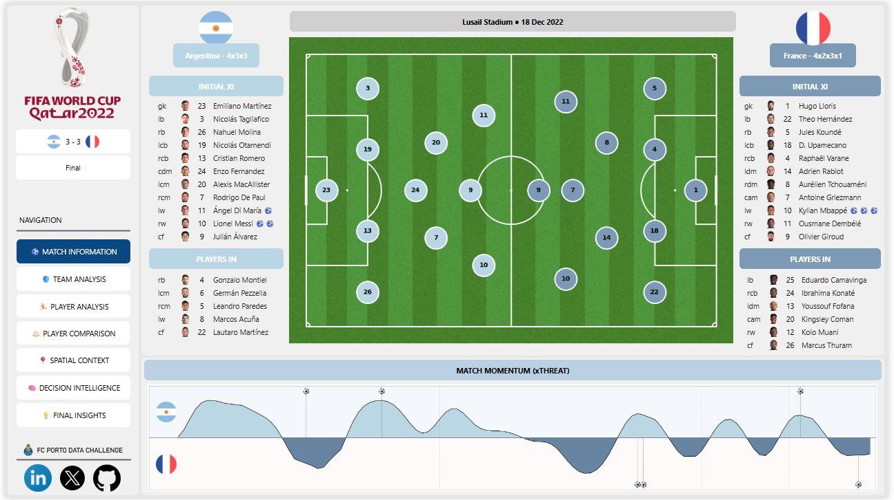
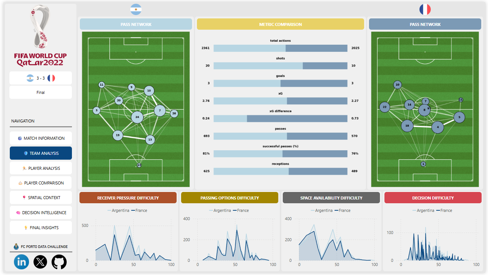
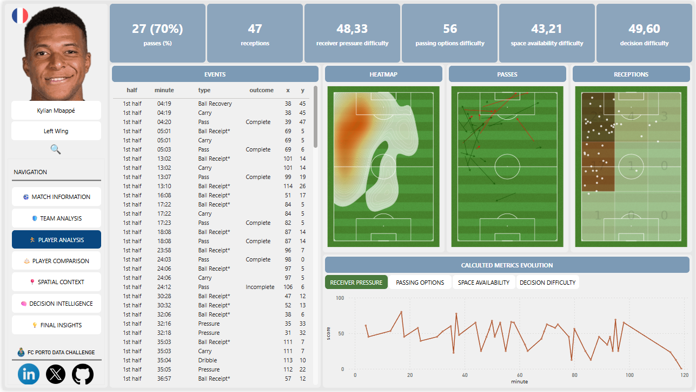
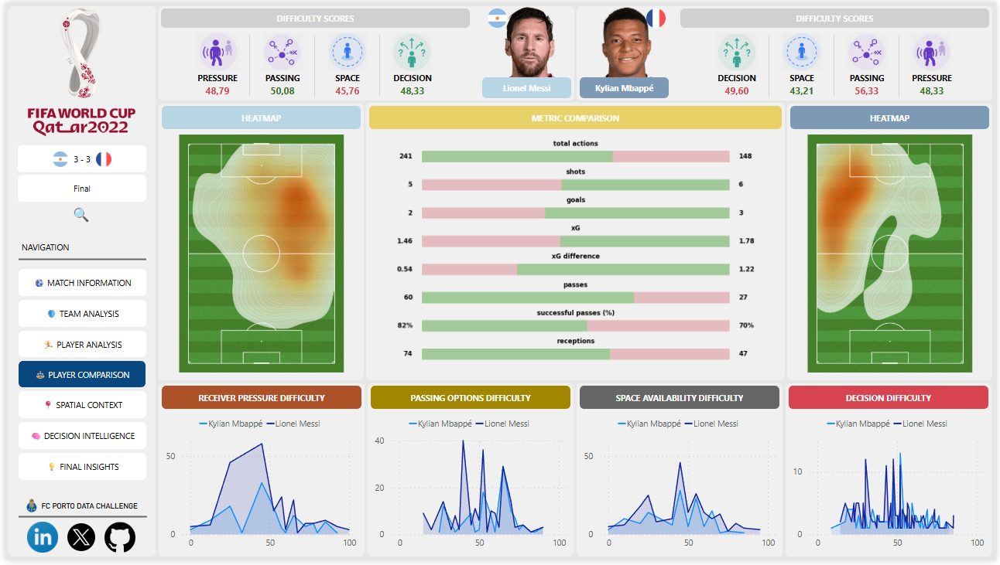
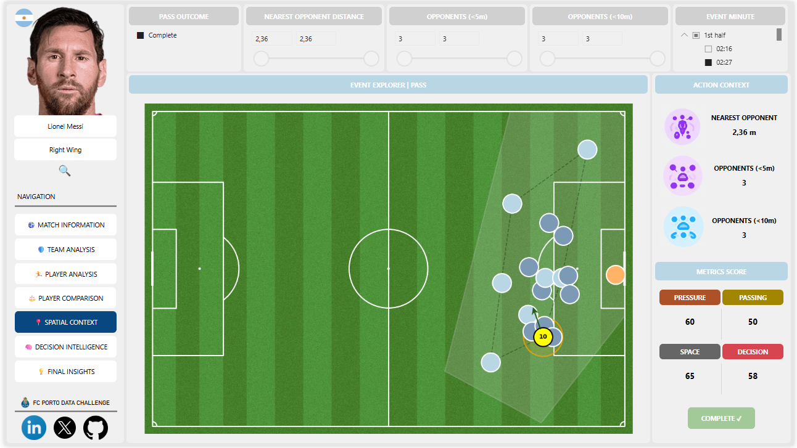
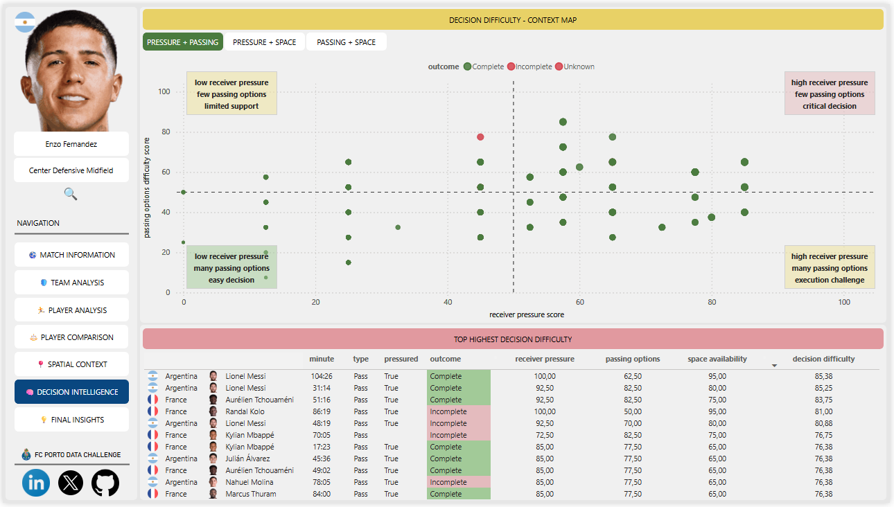
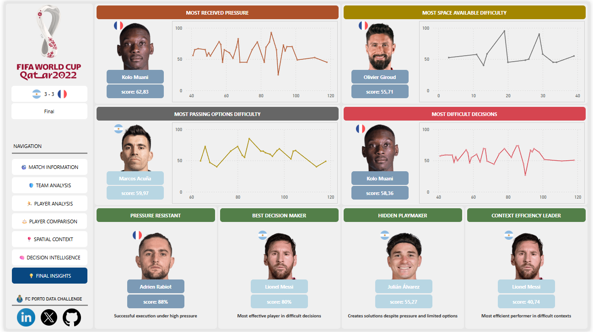

# ⚽ FC Porto Data Challenge

### Context-Aware Football Intelligence using StatsBomb Event & 360 Data

---

## 📖 Project Overview

This project was developed for the **FC Porto Data Challenge** with the objective of transforming raw football event data into a contextual decision-support system capable of evaluating player actions beyond traditional statistics.

Using **StatsBomb Event Data** and **StatsBomb 360 Freeze Frame Data**, a complete analytical pipeline was built, covering:

* Data extraction and validation
* ETL processes
* Star schema data modelling
* Advanced feature engineering
* Spatial football analytics
* Context-aware player evaluation
* Interactive Power BI dashboard development

The final solution combines event actions with spatial player positioning data to quantify the contextual difficulty and quality of football decisions in real match situations.

---

## 🎯 Business Objective

Traditional football metrics often measure *what happened*.

This project aims to understand **why actions happened**, by incorporating the surrounding context of every decision:

* How much pressure was the player under?
* How many passing options were available?
* How much space was available?
* How difficult was the decision itself?

The result is a richer and more realistic evaluation of player performance.

---

## 🏗️ Data Architecture

```text
📂 FC Porto Data Challenge Pipeline

01_statsbomb_exploration_and_etl.ipynb
│
├── StatsBomb Open Data
│   ├── matches
│   ├── lineups
│   ├── match_events
│   └── freeze_frames
│
└── Outputs
    ├── events.csv
    ├── frames.csv
    ├── matches.csv
    └── players.csv

02_feature_engineering.ipynb
│
├── Contextual Metric Engineering
│   ├── Receiver Pressure Score
│   ├── Passing Options Score
│   ├── Space Availability Score
│   └── Decision Difficulty Score
│
└── Analytical Outputs
    ├── dim_matches.xlsx
    ├── dim_players.xlsx
    ├── fct_events.xlsx
    ├── fct_frames.xlsx
    ├── fct_player_stats.xlsx
    └── fct_team_stats.xlsx
```

---

## 🗄️ Analytical Data Model

A Star Schema was designed to support analytical queries and dashboard performance.

### Dimensions

* DIM_MATCHES
* DIM_PLAYERS

### Fact Tables

* FCT_EVENTS
* FCT_FRAMES
* FCT_PLAYER_STATS
* FCT_TEAM_STATS

The model follows a Star Schema design where event-level data is connected to player and match dimensions, enabling efficient aggregations and dashboard performance.

<br>

### Data Model

<p align="center">
  
</p>

---

# 📊 Power BI Dashboard

The dashboard was developed around seven analytical perspectives.

---

## 🏟️ Match Information

Provides complete match context:

* Starting lineups
* Formations
* Match events
* xThreat momentum evolution
* Team structures

<br>

<p align="center">
  
</p>

---

## 🛡️ Team Analysis

Team-level comparison using both traditional and contextual metrics.

### Includes:

* Pass Networks
* xG Comparison
* Passing Success
* Total Actions
* Receptions
* Spatial Difficulty Analysis

### Custom Contextual Metrics

* Receiver Pressure Difficulty
* Passing Options Difficulty
* Space Availability Difficulty
* Decision Difficulty

<br>

<p align="center">
  
</p>

---

## 👤 Player Analysis

Individual player performance analysis.

Each player can be evaluated through:

* Event timelines
* Heatmaps
* Passing maps
* Reception maps
* Contextual metric evolution

### Example

Kylian Mbappé registered:

* 70% passing accuracy
* 47 receptions
* Strong involvement in advanced areas
* Consistently high contextual difficulty scores

<br>

<p align="center">
  
</p>

---

## ⚖️ Player Comparison

Direct comparison between players under the same contextual framework.

Example comparison:

* Lionel Messi vs Kylian Mbappé

Comparing:

* Pressure exposure
* Passing difficulty
* Space availability
* Decision complexity
* Traditional performance indicators

<br>

<p align="center">
  
</p>

---

## 📍 Spatial Context Analysis

One of the most important components of the project.

Each event can be explored alongside its freeze-frame context.

Metrics include:

* Distance to nearest opponent
* Nearby opponents (<5m)
* Nearby opponents (<10m)
* Pressure score
* Space score
* Passing score
* Decision score

This allows every action to be evaluated according to its true difficulty.

<br>

<p align="center">
  
</p>

---

## 🧠 Decision Intelligence

A custom analytical layer designed to evaluate decision complexity.

Actions are mapped according to:

* Receiver pressure
* Available passing options
* Space availability
* Decision difficulty

This creates a contextual framework capable of distinguishing:

* Easy actions
* High-pressure situations
* Limited-support decisions
* High-risk executions

<br>

<p align="center">
  
</p>

---

## 💡 Final Insights

The dashboard identifies players who stand out in specific contextual dimensions.

### Most Received Pressure

🥇 Kolo Muani (score: 62.83)

Consistently operated under the highest pressure levels during possession phases.

### Most Complex Space Management

🥇 Olivier Giroud (score: 55.71)

Operated in situations with reduced spatial availability.

### Highest Passing Difficulty

🥇 Marcos Acuña (score: 59.97)

Faced the most demanding passing environments throughout the match.

### Most Difficult Decisions

🥇 Kolo Muani (score: 58.36)

Frequently executed actions under constrained spatial and tactical conditions.

### Pressure Resistant Player

🥇 Adrien Rabiot (score: 88%)

Maintained high execution efficiency despite elevated pressure levels.

### Best Decision Maker

🥇 Lionel Messi (score: 80%)

Demonstrated the highest success rate when operating in difficult contextual scenarios.

### Hidden Playmaker

🥇 Julián Álvarez (score: 55.27)

Created value despite limited support structures and constrained environments.

### Context Efficiency Leader

🥇 Lionel Messi (score: 40.74)

Combined high involvement with strong execution quality under complex conditions.

<br>

<p align="center">
  
</p>

---

# 🔍 Key Findings

### 🧠 Context Matters More Than Raw Actions

Traditional event counts alone are insufficient to evaluate player performance accurately.

Adding spatial context significantly improves action interpretation.

### 🎯 Pressure Changes Decision Behaviour

Players operating under high pressure tend to reduce available passing choices and face more difficult decision-making scenarios.

### ⚽ Elite Players Thrive Under Contextual Difficulty

The analysis suggests that players such as Lionel Messi maintain high efficiency despite operating in demanding tactical environments.

### 📊 Football Performance Is Multi-Dimensional

Player evaluation should combine:

* Technical execution
* Spatial awareness
* Pressure resistance
* Decision quality
* Team support structure

rather than relying exclusively on traditional football statistics.

---

## 📁 Repository Structure

```text
fcporto-data-challenge
│
├── data
│   ├── processed
│   └── final
│
├── images
│
├── 01_statsbomb_exploration_and_etl.ipynb
├── 02_feature_engineering.ipynb
├── fcporto-data-challenge.pbix
├── fcporto-data-challenge.pdf
└── README.md
```

---

## 🛠️ Technologies

* Python
* Pandas
* NumPy
* StatsBombPy
* Jupyter Notebook
* Power BI
* DAX

---

## 👨‍💻 Author

**Diogo Maia**

FC Porto Data Challenge — Football Analytics & Data Science Project
